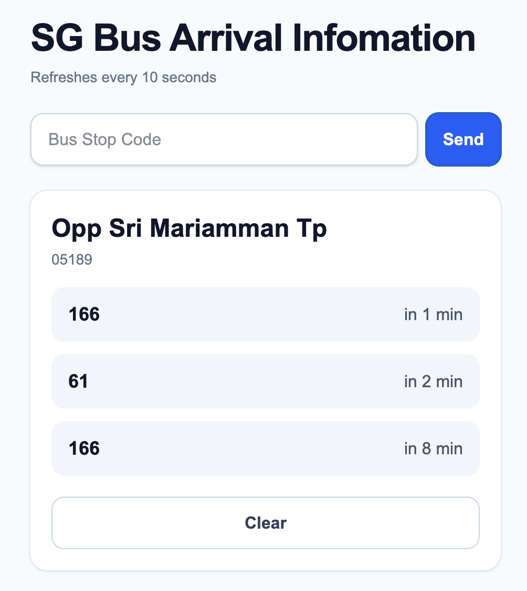

# SG Bus Arrivals

## Introduction

Real-time bus arrival tracker for Singapore built with FastAPI, WebSockets, Redis, and [LTA DataMall API](https://datamall.lta.gov.sg/content/datamall/en.html), deployed on AWS EC2 using Docker.

Live Demo: https://sg-bus-arrivals.com/

## Features

- Real-time bus arrival updates for any bus stop in singapore using WebSockets
- External API integration with the [LTA DataMall API](https://datamall.lta.gov.sg/content/dam/datamall/datasets/LTA_DataMall_API_User_Guide.pdf) by the Singaporean government
- Redis caching for bus stops
- FastAPI backend with async endpoints
- Dockerized deployment with Docker Compose
- Frontend with React and Tailwind CSS
- Full-stack deployment on AWS EC2 using nginx for web server and Caddy for HTTPS.

## How It Works
### Basic Function
 The most basic function of this API project is when a user input [the 5-digit code](https://svc.simplygo.com.sg/eservice/eguide/bscode_idx.php) for any bus stop in Singapore, it fetches the next arrivals for that stop and displays them.
### Caching Sterategy
I decided to cache all the bus stops (5,000+ as of 2026) with Redis under the assumption that the number of bus stops don't change frequently so that I don't have to make calls to the LTA API everytime a user gets arrival information for a bus stop. I chose to use redis for its speed and ease.
### Async HTTP Requests
When we do need to fetch bus stops from the LTA API, I found out that one API call for bus stops can only include up to 500 bus stops in the form of "https://datamall2.mytransport.sg/ltaodataservice/BusStops?$skip={skip}." For example, if I need to get the 501st to 1000th bus stops, skip needs to be 500. For details about this paigination, refer to [this page](https://github.com/lta-rs/lta-rs/issues/18). Given that there are over 5,000 bus stops, I need to make 10+ separate API calls to LTA API, so I decided to make async HTTP requests using HTTPX for this task.

## Tech Stack

### Frontend
- React
- Tailwind CSS

### Backend
- FastAPI
- WebSockets
- httpx
- Redis

### Infrastructure
- Docker
- AWS EC2
- Nginx / Caddy

## Running Locally

###
- Docker
- Docker Compose
- LTA API (https://datamall.lta.gov.sg/content/datamall/en/request-for-api.html)

### Setup
```bash
git clone https://github.com/kotaroyama/Singapore-Bus-API.git
cd Singapore-Bus-API
touch .env
```
In .env, paste your API key for the LTA API in ```API_KEY=```.
```bash
docker compose up --build
```
Frontend should be up at: http://localhost
Backend at: http://localhost:8000

## Challenges
- Handling various various Python objects of different types like lists and dictionaries and flattening data obtained from the LTA API.
- Dealing with pagination on the LTA API
- Error handling when making requests to the LTA API with httpx
- Configuring WebSockets and Nginx

## Todo
- Integrate the search function of the API so that besides 5-digit stop codes, also accept keywords for a bus_stop.

## Screenshots
